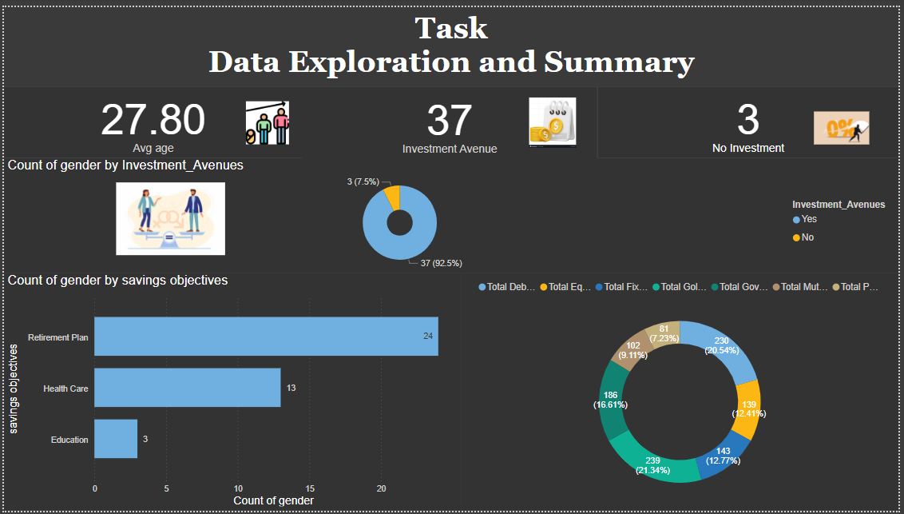
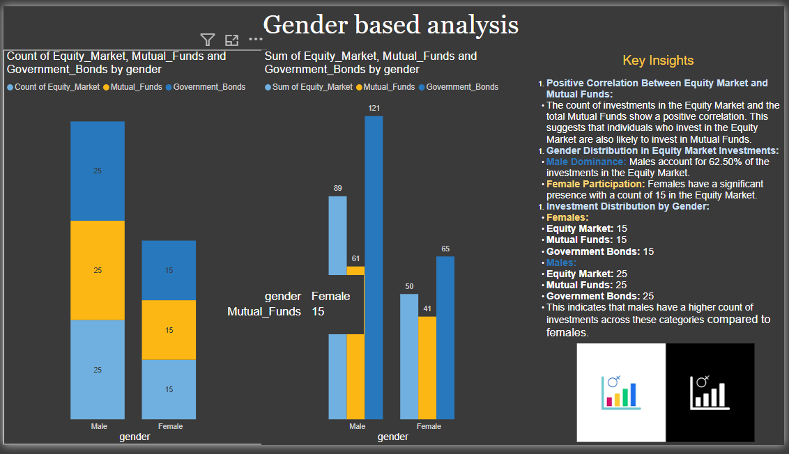
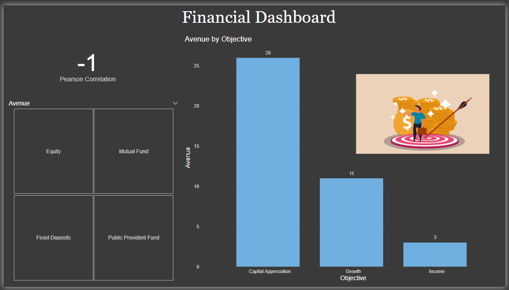
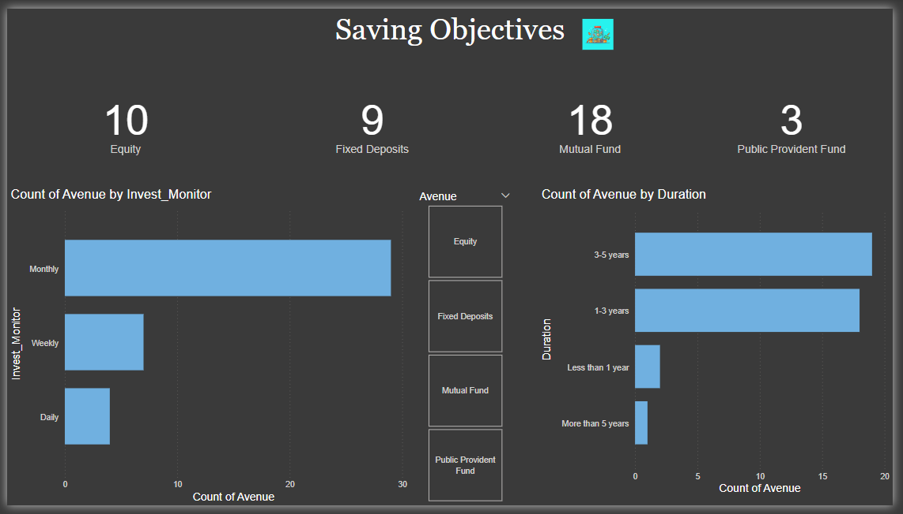
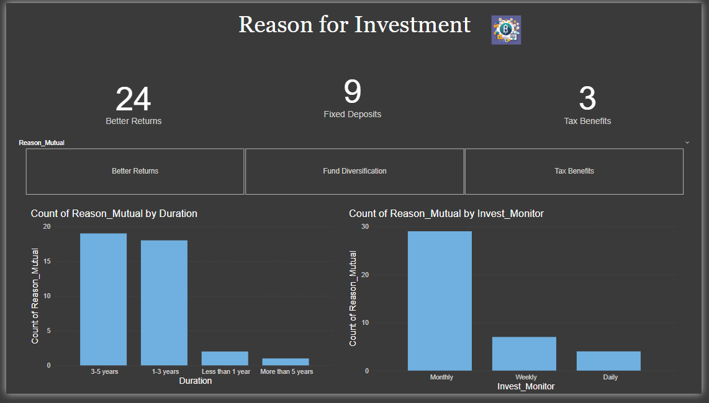
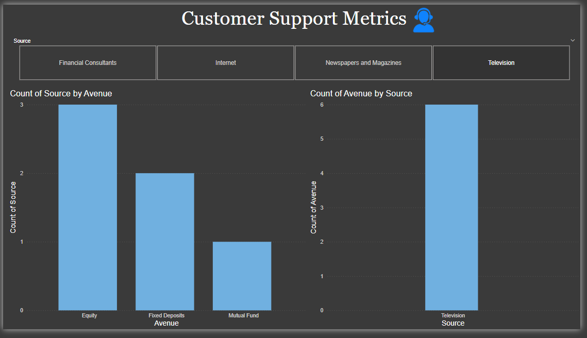
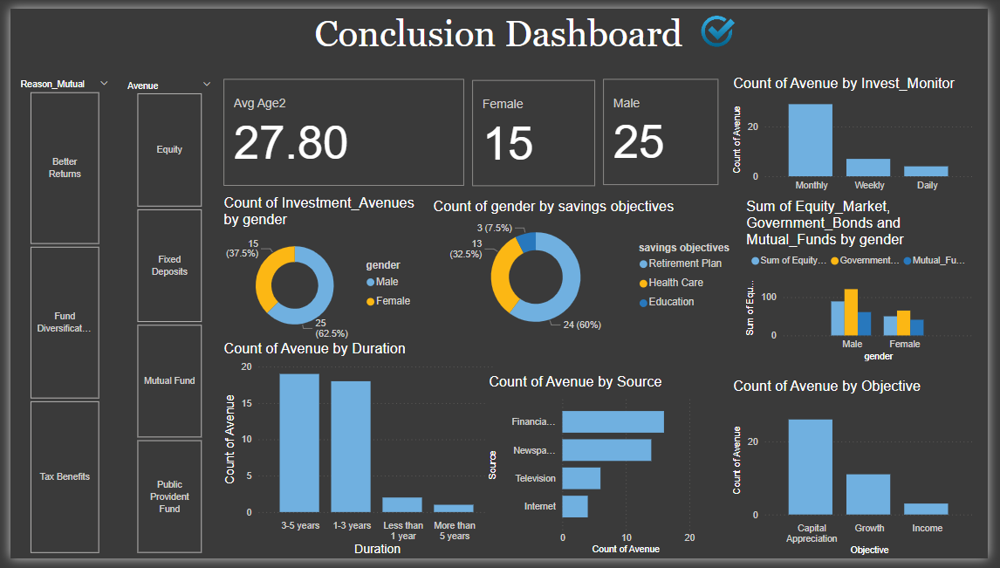

# Financial-Investment-Dashboard

# 📊 Financial Investment Dashboard

A **Power BI** project analyzing **investment patterns**, **saving objectives**, and **demographic trends** in financial investments. This dashboard project transforms raw data into actionable insights for better financial decision-making.

---

## 🟢 Problem Statement

Understanding how individuals choose their investment avenues is key to improving financial planning services. This project analyzes:
- Preferred investment types (Equity, Mutual Funds, etc.)
- Reasons behind investments (Better Returns, Tax Benefits)
- Gender-based trends in financial behavior
- Sources of financial advice influencing decisions

---

## 🛠 Tools Used

| Category           | Tools Used                  |
|--------------------|-----------------------------|
| **Data Cleaning**  | Microsoft Excel             |
| **Data Visualization** | Power BI                   |
| **Development & Version Control** | GitHub                    |

---

## 📁 Dataset Overview
- **Total Records:** 40 (37 investments, 3 non-investors)
- **Columns Included:** Gender, Investment Avenues, Savings Objectives, Duration, Investment Frequency, Source of Information, Reason for Investment
- **Demographics Captured:** Gender, Age

---

## 📊 Dashboards Included

### 1️⃣ Saving Objectives Dashboard
- Mutual Funds are the top investment avenue
- Most investments tracked **monthly**
- Investments are typically **3–5 years** in duration

---

### 2️⃣ Financial Dashboard
- Most common investment objective: **Capital Appreciation**
- **Negative Pearson correlation** observed, indicating opposing patterns between variables

---

### 3️⃣ Data Exploration and Summary
- **Average Investor Age:** 27.8 years
- **Major Saving Goals:** Retirement Planning and Healthcare
- **Investment vs No Investment** breakdown available

---

### 4️⃣ Gender-based Analysis
- **Male investors dominate Equity markets**
- Equal contribution from both genders in Mutual Funds
- Positive correlation between **Equity Market** and **Mutual Funds**

---

### 5️⃣ Reason for Investment
- **Better Returns** is the primary reason for investing
- Most investments monitored **monthly** and expected to deliver returns in **1–5 years**

---

### 6️⃣ Customer Support Metrics
- **Financial Consultants** are the primary influencers for investments
- **Internet** has the lowest influence, suggesting a **digital outreach opportunity**

---

### 7️⃣ Conclusion Dashboard
- Full summary of investment patterns, demographics, sources, and objectives in one view

---

## 📌 Key Insights
- **62.5% of investments are from males**
- **Financial consultants** are key sources of financial advice
- Top saving goal = **Retirement Plan**
- Opportunity: Improve **digital financial literacy programs** especially for underrepresented groups

---

## 🗣️ FAQ / Q&A

| Question                             | Answer                                                                 |
|--------------------------------------|------------------------------------------------------------------------|
| **Why is the Pearson correlation -1?** | Indicates an inverse relationship between some variables; further analysis recommended |
| **Which gender invests more in equities?** | **Males (62.5%)** dominate in equity investments                       |
| **What’s the main savings objective?** | **Retirement Plans**                                                  |
| **Any business recommendations?**    | Increase outreach through **Internet/Digital platforms** for better engagement |

---

## 🙌 About Me

**Hansamalya B**  
📧 hansamalyab@gmail.com  
🌐 [LinkedIn](https://www.linkedin.com/in/hansamalya)

---

> *This project demonstrates my skills in transforming raw financial data into impactful business insights using Power BI.*
